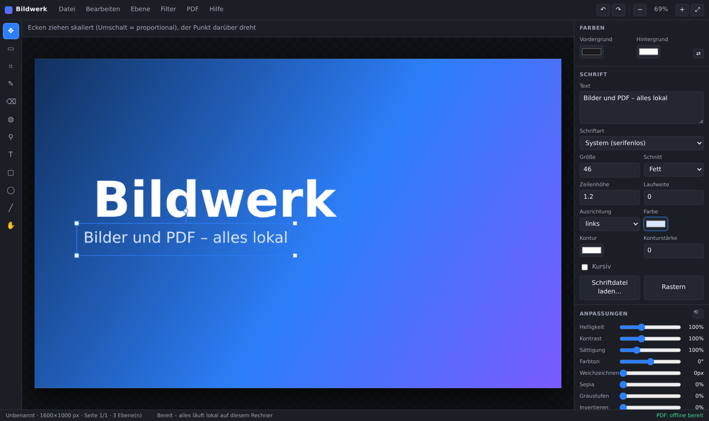

# Bildwerk

Ein Bild- und PDF-Editor, der vollständig **lokal auf Ihrem Rechner** läuft:
im Browser, ohne Installation, ohne Konto, ohne Server. Keine Datei verlässt
den Rechner – es gibt keine Netzwerkverbindung im Programm.

Der komplette Editor belegt rund **110 KB**. Mit den beiden optionalen
PDF-Bibliotheken sind es etwa **2 MB**.



## Starten

**Weg 1 – Doppelklick (am einfachsten)**

`bildwerk-standalone.html` im Browser öffnen. Das ist eine einzige Datei,
die alles enthält.

**Weg 2 – mit kleinem lokalem Webserver**

```sh
sh start.sh            # Linux/macOS  (Windows: start.cmd doppelklicken)
```

Öffnet automatisch http://127.0.0.1:8777/. Dieser Weg lädt die Einzelmodule
aus `js/` und eignet sich, wenn Sie am Programm selbst etwas ändern wollen.

**PDF-Funktionen freischalten (einmalig, ~1,9 MB)**

```sh
sh vendor/get-libs.sh
```

Damit liegen pdf.js und pdf-lib lokal vor und Bildwerk arbeitet dauerhaft
offline. Ohne diesen Schritt versucht das Programm, die beiden Bibliotheken
von einem CDN zu laden; klappt auch das nicht, bleibt der Bildeditor voll
benutzbar und nur die PDF-Funktionen sind abgeschaltet. Die Statusleiste
unten rechts zeigt den Zustand an.

## Was das Programm kann

**Bilder bearbeiten**
- Ebenen: anlegen, duplizieren, umbenennen, sortieren, ein-/ausblenden,
  Deckkraft, 16 Mischmodi (Multiplizieren, Weiches Licht, Differenz …)
- Verschieben, Skalieren (Umschalt = proportional) und Drehen über Anfasser
- Pinsel und Radierer mit Größe, Härte und Deckkraft
- Farbeimer mit Toleranz, Pipette, Rechteckauswahl, Zuschneiden
- Rechteck, Ellipse und Linie als nachträglich änderbare Formebenen
- Nicht-destruktive Anpassungen je Ebene: Helligkeit, Kontrast, Sättigung,
  Farbton, Weichzeichnen, Sepia, Graustufen, Invertieren – jederzeit
  zurücknehmbar oder per „Anpassungen einrechnen“ festschreibbar
- Filter: Schärfen, Kanten, Relief, Verpixeln, Rauschen, Tontrennung,
  Schwellenwert, Vignette, Auto-Tonwert, Spiegeln, Drehen
- Dokumentgröße und Bildgröße ändern, Historie mit 40 Schritten

**Schriften**
- Textebenen bleiben editierbar: Inhalt, Größe, Schnitt, Zeilenhöhe,
  Laufweite, Ausrichtung, Farbe und Kontur lassen sich jederzeit ändern
- Systemschriften plus **eigene Schriftdateien** (.ttf, .otf, .woff, .woff2);
  geladene Schriften werden in der Projektdatei mitgespeichert

**PDF verändern**
- Mehrseitige PDFs öffnen und Seite für Seite bearbeiten
- Seiten anhängen, duplizieren, löschen, drehen; mehrere PDFs zusammenführen
- Text, Bilder und Formen auf bestehende Seiten legen
- Export in zwei Modi:
  - **Original beibehalten** – die Originalseiten werden unverändert
    übernommen, bestehender Text bleibt echter, durchsuchbarer Text.
    Neue Textebenen werden, wo möglich, ebenfalls als echter PDF-Text
    geschrieben, der Rest als passgenaues Overlay.
  - **Alles rastern** – jede Seite wird als Bild neu aufgebaut.

**Ein- und Ausgabe**
- Öffnen: PNG, JPEG, WebP, GIF, BMP, SVG, PDF (auch per Drag & Drop)
- Export: PNG, JPEG (mit Qualitätswahl), WebP, PDF
- Projektdatei `.bildwerk` mit allen Ebenen, Einstellungen und Schriften

## Tastenkürzel

| Taste | Wirkung |
|---|---|
| `V` `M` `C` | Verschieben · Auswahl · Zuschneiden |
| `B` `E` `G` | Pinsel · Radierer · Farbeimer |
| `I` `T` `U` | Pipette · Text · Rechteck |
| `Strg+Z` / `Strg+Y` | Rückgängig / Wiederholen |
| `Strg+J` | Ebene duplizieren |
| `Strg+D` / `Entf` | Auswahl aufheben / Auswahl leeren |
| `Eingabe` | Zuschnitt bestätigen |
| `Strg+N` `Strg+O` `Strg+S` | Neu · Bild öffnen · Projekt speichern |
| `Strg+E` | Als PNG exportieren |
| `+` `−` `0` | Zoom größer, kleiner, einpassen |
| `Strg`+Mausrad | Stufenlos zoomen |
| `[` `]` | Pinsel kleiner / größer |
| `X` | Vorder- und Hintergrundfarbe tauschen |
| Pfeiltasten | Ebene um 1 px (mit Umschalt 10 px) verschieben |
| `Bild ↑/↓` | Seite wechseln |

## Ehrliche Einordnung

Bildwerk deckt die alltägliche Bild- und PDF-Arbeit ab, ist aber kein
Photoshop-Ersatz im vollen Funktionsumfang. Bewusst **nicht** enthalten sind
unter anderem: freie Auswahlwerkzeuge (Lasso, Zauberstab), Ebenenmasken,
Einstellungsebenen, Pfade und Vektorwerkzeuge, Smartobjekte, CMYK und
Farbprofile, RAW-Entwicklung, inhaltsbasiertes Füllen sowie 16/32-Bit-Farbtiefe.
Gerechnet wird mit 8 Bit pro Kanal im sRGB-Raum des Browsers.

Große Dokumente kosten Arbeitsspeicher: Jede Ebene liegt als eigenes Bild im
RAM, und die Historie hält bis zu 40 Schritte vor.

## Aufbau des Programms

| Datei | Inhalt |
|---|---|
| `js/core.js` | Dokumentmodell, Ebenen, Transformationen, Rendering, Historie |
| `js/tools.js` | Werkzeuge und Zeigerinteraktion, Anfasser |
| `js/filters.js` | Pixeloperationen (Faltung, Flood-Fill, Tonwerte) |
| `js/pdfio.js` | PDF lesen, Seiten verwalten, PDF schreiben |
| `js/fonts.js` | System- und eigene Schriften |
| `js/ui.js` | Oberfläche, Panels, Dialoge |
| `js/commands.js` | Menübefehle, Dateiein- und -ausgabe |
| `js/main.js` | Start, Menüs, Tastatur, Drag & Drop |
| `tools/build-standalone.py` | erzeugt `bildwerk-standalone.html` neu |
| `tools/selftest.mjs` | Selbsttest im echten Browser |

Nach Änderungen in `js/` oder `css/` die Einzeldatei neu bauen:

```sh
python3 tools/build-standalone.py
```

Der Selbsttest fährt einen echten Browser hoch und prüft Pinsel, Historie,
Formen, Text, Filter, PNG-Export sowie den kompletten PDF-Weg (öffnen,
Text ergänzen, exportieren, Text wieder auslesen):

```sh
sh start.sh &
npm i -D playwright && npx playwright install chromium
node tools/selftest.mjs
```

## Lizenz und Fremdcode

Bildwerk selbst steht unter derselben Lizenz wie dieses Repository.
Die optionalen Bibliotheken in `vendor/` sind Fremdcode:
pdf.js (Mozilla, Apache-2.0) und pdf-lib (MIT). Sie werden nicht mit
eingecheckt, sondern bei Bedarf mit `vendor/get-libs.sh` geholt.
